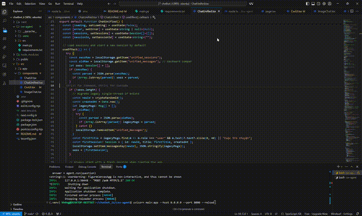

This is a [Next.js](https://nextjs.org) project bootstrapped with [`create-next-app`](https://nextjs.org/docs/app/api-reference/cli/create-next-app).

## Getting Started

First, run the development server:

```bash
npm run dev
# or
yarn dev
# or
pnpm dev
# or
bun dev
```

Open [http://localhost:3000](http://localhost:3000) with your browser to see the result.

You can start editing the page by modifying `app/page.tsx`. The page auto-updates as you edit the file.

This project uses [`next/font`](https://nextjs.org/docs/app/building-your-application/optimizing/fonts) to automatically optimize and load [Geist](https://vercel.com/font), a new font family for Vercel.

## Learn More

To learn more about Next.js, take a look at the following resources:

- [Next.js Documentation](https://nextjs.org/docs) - learn about Next.js features and API.
- [Learn Next.js](https://nextjs.org/learn) - an interactive Next.js tutorial.

You can check out [the Next.js GitHub repository](https://github.com/vercel/next.js) - your feedback and contributions are welcome!

## Deploy on Vercel

The easiest way to deploy your Next.js app is to use the [Vercel Platform](https://vercel.com/new?utm_medium=default-template&filter=next.js&utm_source=create-next-app&utm_campaign=create-next-app-readme) from the creators of Next.js.

Check out our [Next.js deployment documentation](https://nextjs.org/docs/app/building-your-application/deploying) for more details.

---

# AI Chat App (Assignment)

## Demo

- **Chat Unified (2025)**: `public/demo/chat-unified-2025.mp4` → http://localhost:3000/demo/chat-unified-2025.mp4

[](https://raw.githubusercontent.com/vo-hoang-kh4ng/chatbot-ii/main/public/demo/chat-unified-2025.mp4)

> Lưu ý: Video đầy đủ khá dài nên README chỉ hiển thị GIF xem trước (vài giây).
> Muốn xem full, bấm liên kết sau: https://github.com/vo-hoang-kh4ng/chatbot-ii/blob/main/public/demo/chat-unified-2025.mp4

## Features

- **Core Chat**: đa lượt, hiển thị ai nói gì và khi nào, markdown cơ bản, trạng thái đang trả lời.
- **Image Chat**: tải ảnh (PNG/JPG) hoặc nhập URL, xem trước ảnh, hỏi đáp về nội dung ảnh (trả lời tham chiếu rõ ràng tới ảnh).
- **CSV Data Chat**: nhận CSV qua file hoặc URL, tóm tắt, thống kê cơ bản cho cột số, cột thiếu nhiều nhất, vẽ histogram (bằng Recharts).
- **Xử lý lỗi**: báo lỗi URL xấu, file quá lớn (>10MB), lỗi parse CSV, thiếu API key.

## Tech Stack

- **Frontend**: Next.js 16 (App Router), TypeScript, TailwindCSS, React Markdown, Recharts.
- **Backend**: Next.js Route Handlers (`src/app/api/*`).
- **AI**: OpenAI (chat và vision).

## Project Structure

```
src/
  app/
    api/
      chat/route.ts      # Chat với OpenAI
      image/route.ts     # Vision Q&A (URL hoặc tải file)
      csv/route.ts       # Tóm tắt/thống kê CSV, missing, histogram
    page.tsx             # Tabs: Chat / Image / CSV
    layout.tsx, globals.css
  components/
    ChatUI.tsx
    ImageChat.tsx
    CsvUI.tsx
```

## Setup

1. Cài dependencies:
```bash
npm install
npm install openai react-markdown recharts zod csv-parse d3-array
```

2. Tạo file env và đặt API key:
```bash
echo "OPENAI_API_KEY=your-api-key-here" > .env
```

3. Chạy dev server:
```bash
npm run dev
```
Mở http://localhost:3000

4. Yêu cầu Node.js:
- Next.js 16 cần Node >= 20.9.0 (khuyến nghị LTS 22). Nếu đang dùng Node 18, hãy nâng cấp qua nvm.

## Demo Guide

- **Chat**: nhập câu hỏi → xem lịch sử, timestamp, markdown.
- **Image**: chọn file hoặc dán URL ảnh → đặt câu hỏi → xem trả lời có cụm "In the image, ...".
- **CSV**: tải file hoặc dán URL raw CSV → chọn "Tóm tắt/Thống kê/Missing/Histogram" → xem bảng/biểu đồ.

## Notes

- Secrets giữ trong `.env`; không commit khóa.
- CSV lớn được chặn ở mức 10MB ở UI. Có thể tăng tùy ý.

---

## CSV Agent (tùy chọn)

Microservice Python dùng LangChain `create_pandas_dataframe_agent` để trả lời câu hỏi tự nhiên về CSV (vd: "Plot a histogram of price"). UI có chế độ "Agent" sẽ gọi service này qua HTTP.

### Cách chạy CSV Agent

```bash
# vào thư mục microservice
cd csv-agent

# khuyến nghị tạo venv (tùy chọn)
python3 -m venv .venv
source .venv/bin/activate

# cài thư viện
pip install -r requirements.txt

# đặt API key (dùng cùng key với Next.js)
export OPENAI_API_KEY=your-api-key-here

# chạy service
uvicorn main:app --host 0.0.0.0 --port 8000 --reload
```

Service sẽ chạy ở `http://localhost:8000`:

- Health check: `GET /health` → `{ "status": "ok" }`
- Hỏi agent: `POST /ask` (multipart form)
  - Trường: `question` (bắt buộc) + một trong `csv_url` | `file` | `csv_text`
  - Response: `{ answer: string, image_base64?: string }`

### Dùng trong UI

- Vào tab **CSV Data Chat** → chọn **Chế độ: Agent (Python/LangChain)**.
- Cung cấp CSV (URL hoặc file), nhập câu hỏi tự nhiên rồi bấm "Hỏi Agent".
- Nếu agent vẽ biểu đồ, UI sẽ hiển thị ảnh (base64) trả về.
